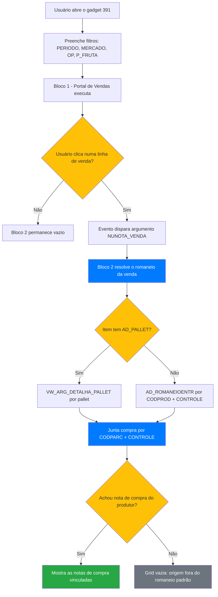

<div align="center">
  
</div>

# 📊 DASH-ACOMPANHAMENTO-DE-VENDASCOMPRA-MP — Associação Venda × Compra de Matéria-Prima

> Gadget de BI (mestre/detalhe) que mostra, para cada nota de venda, quais notas de compra de matéria-prima dos produtores a compõem.


## 📖 Sobre

O painel existente de acompanhamento de vendas/compras (**AG 35**, código `94` no Construtor de Componentes) mostra dois blocos independentes — Portal de Vendas e Portal de Compras — filtrados apenas pelo mesmo período de movimento. Como a colheita/compra da matéria-prima de um produtor pode acontecer dias, semanas ou até meses antes da nota de venda (exportação) correspondente, os dois blocos frequentemente não batem, obrigando o time a cruzar manualmente números de controle e romaneios nota por nota — um trabalho que já consumiu mais de uma hora por conferência.

Este gadget resolve o problema invertendo a lógica: em vez de filtrar as duas listas pelo mesmo período, o bloco de vendas funciona como **mestre** e o bloco de compras como **detalhe**. Ao clicar numa nota de venda, o sistema resolve o produtor e o romaneio/lote daquele item (via pallet ou via controle direto) e busca as notas de compra reais daquele produtor para aquele lote — sem nenhum filtro de data no lado da compra. Isso entrega diretamente para os despachantes quais notas de compra do produtor sustentam cada nota de venda, para uso na documentação de exportação.

Não substitui o painel AG 35 — é um gadget novo e separado. (O 94 ganhou colunas próprias no GLPI 1812: ver `94_component_colheita.xml` e o Changelog.)

## 📁 Estrutura do Projeto

```
DASH-ACOMPANHAMENTO-DE-VENDASCOMPRA-MP/
├── 391_venda_compra_mp_marcio.sql   # Queries do gadget 391 (Bloco 1 - Vendas / Bloco 2 - Compras)
├── relatorio_venda_compra_produtor.sql  # Versão inicial em consulta única (referência/export flat)
├── 94_component.xml                 # XML do painel AG 35 exportado em 16/09/2026 (original, não modificado)
├── 94_component_colheita.xml        # Cópia do 94 com romaneio de entrada, produção e colheita (GLPI 1812)
├── sql/94_portal_vendas_colheita_DBEXPLORER.sql  # Consulta nova do Portal de Vendas (94) com valores fixos, para o DbExplorer
├── sql/TESTE_94_colheita.sql        # Testes do GLPI 1812 para o DbExplorer
├── Meeting started ... Notes by Gemini.md  # Ata da reunião que originou o requisito
└── README.md
```

## 📚 Referência das Consultas

Não há classe Java nem botão de ação neste projeto — a lógica inteira está nas consultas SQL das duas grids do gadget.

| Grid | Papel | Parâmetros de entrada | Descrição |
|------|-------|------------------------|-----------|
| Tabela 1 — Portal de Vendas | Mestre | `PERIODO`, `MERCADO`, `OP`, `P_FRUTA` (prompt-parameters do gadget) | Lista as notas de venda no período/filtros escolhidos |
| Tabela 2 — Portal de Compras | Detalhe | `NUNOTA_VENDA` (argumento vindo do clique na Tabela 1) | Resolve romaneio/produtor da venda selecionada e lista as notas de compra vinculadas |

## 🗄️ Objetos de Banco de Dados

### Tabelas envolvidas (somente leitura)

| Tabela | Alias | Operação | Descrição |
|--------|-------|----------|-----------|
| `TGFCAB` | CAB | READ | Cabeçalho das notas (venda e compra) |
| `TGFITE` | ITE | READ | Itens das notas |
| `TGFPRO` | PRO | READ | Cadastro de produtos |
| `TGFPAR` | PAR | READ | Parceiros (comprador / produtor) |
| `TCSPRJ` | PRJ | READ | Projeto/Processo (identificação do embarque) |
| `TGFTOP` | TOP | READ | Tipo de operação |
| `TSICID` / `TSIUFS` / `TSIPAI` | CID / UFS / PAI | READ | Localização do parceiro (define MERCADO ME/MI) |
| `TGFVEI` | NAV | READ | Veículo/navio vinculado ao embarque |
| `AD_FRUTA` | AF | READ | Cadastro de frutas (filtro `P_FRUTA`) |
| `VW_ARG_DETALHA_PALLET` | PL | READ | View customizada com romaneio/produtor detalhado por pallet |
| `AD_ROMANEIOENTR` | AR | READ | Romaneio de entrada — recebimento de matéria-prima do produtor |

### Campos customizados consumidos (já existentes, não criados neste projeto)

| Campo | Tabela | Descrição |
|-------|--------|-----------|
| `AD_PALLET` | TGFITE | Pallet do item de venda |
| `CONTROLE` | TGFITE | Lote/romaneio do item (venda ou compra) |
| `AD_EX_CONTAINER`, `AD_EX_DTPREVEMB`, `AD_EX_DTPREVDES` | TGFCAB | Container, ETD e ETA do embarque |
| `AD_NAVIO` | TGFVEI | Nome do navio |

### Functions/Procedures

Nenhuma foi criada. Toda a lógica de associação (resolução de romaneio via pallet ou via controle direto, e o cruzamento com a compra) está implementada em CTEs dentro do próprio SQL de cada grid.

## 🚀 Guia de Implantação

### 1. Criar o gadget no Construtor de Componentes de BI
Localizar ou criar o componente **391 — VENDAS/COMPRA MP-MARCIO**.

### 2. Criar os prompt-parameters (nível Principal)
- `PERIODO` — `metadata="datePeriod"`
- `MERCADO` — `metadata="multiList:Text"` (itens `ME`=Mercado Externo, `MI`=Mercado Interno)
- `OP` — `metadata="multiList:Text"` (VENDA, DEVOLUCAO, TRANSFERENCIA, REFUGO, COMPLEMENTAR, REMESSA, OUTROS)
- `P_FRUTA` — `metadata="multiList:Text" listType="sql"` → `SELECT CODFRUTA VALUE, NOME LABEL FROM AD_FRUTA`

### 3. Montar as duas grids
Duas `Tabela` empilhadas verticalmente no nível Principal.

### 4. Colar as queries
- Tabela 1 (topo): query do **BLOCO 1** de `391_venda_compra_mp_marcio.sql`.
- Tabela 2 (embaixo): query do **BLOCO 2** do mesmo arquivo (usa o bind `:NUNOTA_VENDA`).

### 5. Configurar o evento mestre → detalhe
Na Tabela 1: **Evento → Atualizar detalhes** → marcar a Tabela 2 → adicionar argumento:
- Argumento: `NUNOTA_VENDA`
- Tipo: `Número Inteiro`
- Valor: `${NUNOTA}` (referencia o campo `NUNOTA` da linha clicada na grid mestre)

### 6. Testar
Abrir o preview, preencher os filtros obrigatórios, clicar numa linha da venda e confirmar que a Tabela 2 atualiza com as compras do produtor.

## 🔄 Fluxo de Execução



## ⚠️ Observações Importantes

- **Ligação por produtor + controle, nunca por produto:** o vínculo é feito por `CODPARC` (produtor) + `CONTROLE` (romaneio/lote). O `CODPROD` da compra (matéria-prima) pode ser diferente do `CODPROD` da venda (produto acabado), então não pode entrar como critério de junção.
- **Relação N-para-N:** uma única nota de venda pode puxar várias notas de compra do mesmo produtor/lote — isso é esperado (várias entregas do produtor viram uma venda só).
- **Bloco de Compras sem filtro de período — de propósito:** é essa mudança que resolve a divergência de datas do painel AG 35.
- **Grid de compra vazia nem sempre é bug.** Pode ser: (a) item de venda sem `CONTROLE`/`AD_PALLET` (devolução, transferência, ajuste); (b) romaneio que não existe em `AD_ROMANEIOENTR` — origem fora do fluxo padrão de recebimento (ex.: produto comprado já processado de uma trading). Para checar: `SELECT * FROM AD_ROMANEIOENTR WHERE ROMANEIO = <valor>`.
- **Sintaxe do argumento no Construtor de Componentes:** no campo "Valor" do evento "Atualizar detalhes", o nome do campo puro (`NUNOTA`) é tratado como texto literal e quebra com `ORA-01722`. É necessário usar `${NUNOTA}` para referenciar o valor da linha selecionada.
- **O gadget 391 não altera o painel AG 35** (código `94`). As colunas de colheita do 94 (GLPI 1812) estão em `94_component_colheita.xml`; regra no ArgoFrutaContext, nota "Padrão - Data de Colheita do Pallet (AD_ROMANEIOENTR)".

## 📋 Changelog

| Versão | Data | Descrição | Autor |
|--------|------|-----------|-------|
| 1.0.0 | 2026-09-16 | Versão inicial: gadget mestre/detalhe de associação venda × compra por produtor (controle/romaneio) | Natan |
| 1.1.0 | 2026-09-29 | GLPI 1812: painel 94 (Portal de Vendas) ganha ROMANEIO_ENTRADA, DT_PRODUCAO, DT_MIN_COLHEITA e QT_DIAS_COLHEITA (dias da colheita até a saída da nota), com a mesma regra de colheita do dash 208 | Natan |

## 👤 Autor

**Francisco Natanael Lopes Vasconcelos (Natan)**
- 🏢 Grupo Argo (Argo Fruta)
- 📧 natanael.lopes@argofruta.com
- 🐙 [GitHub](https://github.com/GrupoArgoFruta)
